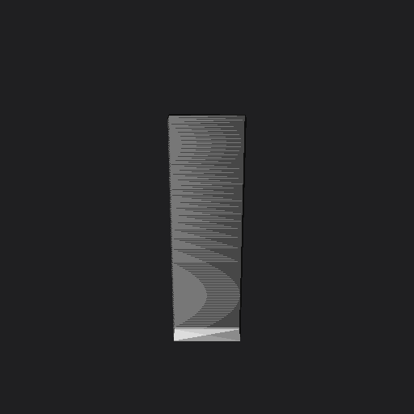
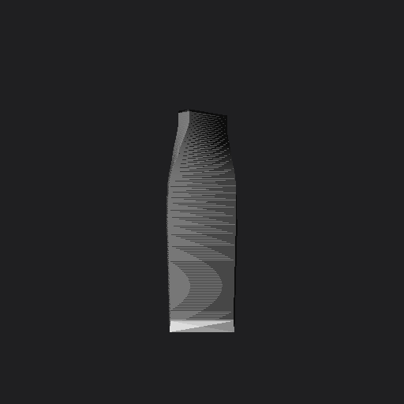

# Skinning quality: metrics, acceptance suite, and the Mixamo comparison protocol

Issue [#819](https://github.com/fernandotonon/QtMeshEditor/issues/819) (Skinning v2, Slice E).
The algorithms these measure: **GeodesicVoxel** (default, Slice A),
**InverseDistance** (#402 legacy / fallback), the Slice-B post-passes,
and the **Dual-Quaternion display toggle** (Slice D).

## Metrics

All computed by `qtmesh skin <file> --evaluate [--json]` on the asset's
**existing** weights (whoever authored them), and by the pure-data
`SkinMetrics` / `SkinWeightsPost` APIs in the acceptance tests.

| Metric | Definition | Good looks like |
|---|---|---|
| Influence histogram | vertices per influence count (0–8), average, max | max ≤ 4 (hardware-skinning convention) |
| Weight smoothness | Laplacian energy: mean over mesh edges of ‖w_u − w_v‖² | lower = smoother falloffs; hard 0/1 borders score ~2 per edge |
| Bleed fraction | share of committed (vertex, bone) weights whose bone is **not geodesically local** to the vertex (GeodesicVoxelBind field) | 0 — geodesic-voxel weights are 0 by construction |
| Volume preservation | LBS-deformed / rest mesh volume under a specified joint rotation (`SkinMetrics::deformLBS` + `meshVolume`) | ≥ 0.9 at a 90° single-joint bend |

## Acceptance suite (CI)

Procedural, hermetic fixtures in `src/SkinMetrics_test.cpp` /
`src/GeodesicVoxelBind_test.cpp` (no binary assets, no downloads):

- **Two-limb proximity pair** (boxes 0.5 units apart, one bone each):
  geodesic-voxel bleed = **0** (asserted exactly); the inverse-distance
  contrast on the same fixture must show > 0.1 bleed — if it stops
  bleeding the fixture has lost its meaning.
- **U-shape bend-not-chord**: weights follow the geodesic path, never
  the Euclidean chord between arm tips.
- **Cracked (non-watertight) box**: weights match the closed box —
  voxel-scale hole closing.
- **90° elbow bend** (capsule tube, radius 0.5 × length 4, two bones,
  smoothing 8): volume ratio ≥ **0.9**. Reference run: **0.911**
  (rest 2.828, bent 2.577). For twists beyond what any weight map can
  fix, use the Dual-Quaternion display toggle (Slice D).
- **Smoothing property**: Laplacian relaxation strictly reduces the
  weight-field energy.

## Evaluating an asset

```bash
qtmesh skin character.fbx --evaluate            # text report
qtmesh skin character.fbx --evaluate --json     # machine-readable
qtmesh skin character.fbx --evaluate --voxel-res 128   # finer bleed field
```

Sample output (bandit.fbx, 90k verts, 119 bones, skinned by
`qtmesh skin --algo geodesic-voxel`):

```
Skin Evaluation
===============
Vertices:            90573
Bones:               119
Avg influences:      3.47
Max influences:      4
Smoothness energy:   0.004... (lower = smoother falloffs)
Bleed fraction:      0.0055 (weights not geodesically local)
```

## Mixamo comparison protocol (manual — no Adobe assets in-repo)

Adobe's Mixamo auto-rigger is the industry reference for one-click
skinning. The protocol compares our weights against it on the same
mesh without committing any Adobe-derived asset:

1. Take a CC0 humanoid (e.g. a [Quaternius](https://quaternius.com)
   character), export it **unrigged** as FBX.
2. Upload to [mixamo.com](https://www.mixamo.com), auto-rig with the
   default skeleton (no animation), download as FBX Binary, T-pose.
   Keep the file local — it is Adobe-processed and must not be
   committed.
3. Rig + skin the same unrigged mesh with ours:
   `qtmesh rig model.fbx --skeleton humanoid --skin -o ours.fbx`
   (or `qtmesh skin` if you already have a matching skeleton).
4. Compare: `qtmesh skin ours.fbx --compare mixamo_ref.fbx --json`
   — vertices are matched by position (Mixamo re-exports reorder
   them), bones by name; the report gives mean/max per-vertex weight
   L1 difference and the top-10 differing bones.
5. Also run `--evaluate` on both files and compare the metric table.

Interpretation: bone names differ between our templates and Mixamo's
(`mixamorig:*`) — rename with `qtmesh anim --rename` or map manually;
unmatched bone names inflate the L1 diff. The #819 target: UniRigML
within 10% of the Mixamo reference on the `--evaluate` metrics, GVB
within 20%.

The env-gated regression test (`SkinEvaluateTest.CompareAgainstReference`)
runs the comparison automatically when `QTMESH_SKIN_REF_FBX` (the
Mixamo file) and `QTMESH_SKIN_OURS_FBX` are set; it is skipped
otherwise, so CI stays hermetic.

### Recorded run (2026-07-10, bandit.fbx — artist-skinned reference)

Reference: a production character ("bandit", UE-style rig — `pelvis` /
`spine_03` / `thigh_twist_01_l` naming, 119 bones, 90,573 verts,
artist-painted weights) used in place of a Mixamo export — same
`--compare`/`--evaluate` pipeline; a Mixamo-exported reference slots
into the identical commands. Both candidates were skinned by the
app on a same-pipeline copy of the mesh (skeleton preserved,
weights recomputed), then compared against the artist original.

| metric | SkinTokens ML (+ geodesic localisation) | GeodesicVoxel | artist reference |
|---|---|---|---|
| Mean weight L1 vs artist | **1.2241** | **1.0929** | — |
| Avg influences / vertex | 2.52 | 3.44 | 2.22 |
| Max influences | 4 | 4 | 4 |
| Smoothness energy (lower = smoother) | 0.0209 | 0.0124 | 0.0099 |
| Bleed fraction (non-geodesically-local weight) | 0.0764 | 0.0283 | **0.1426** |

Top differing bones in both cases are the head/spine/pelvis mass
distribution plus accessory bones (`hat`, `holster`, `ponytail_*`) —
places where artists paint deliberate stylistic weights. Notably the
artist reference itself scores the *highest* bleed: artists
intentionally assign non-local weights (twist bones, accessories),
which is also why weight-L1 vs the artist is a proxy, not a verdict —
the visual pick in production use was the ML skinner (see the default
choice in `SkinWeights`).

## Dual-quaternion display (Slice D)

`Animation mode → Skinning → Display: Linear | Dual Quaternion`, or
MCP `set_skinning_display {mode: "dual-quaternion"}`. Kills the
candy-wrapper collapse on twists that no weight map can fix. Display
only: exporters consume the unchanged vertex weights — engines
re-skin with their own blend. Entities above the RTSS bone cap (96)
stay on the default path.

### Forearm-twist comparison (recorded 2026-07-10)

Reproducible fixture — a dense 0.6×0.18 bar (486 verts, 121 rings),
auto-rigged with the `generic` 3-joint template, GVB-skinned, with a
"Twist" animation (Top bone, 0° → 180° about the bone axis) injected
into the exported glTF. Headless LBS renders via the pose pipeline:

```
qtmesh pose twist_bar_rig.gltf2 --animation Twist --time 0.5 -o bar_90.stl
qtmesh turntable bar_90.stl -o bar_90_%02d.png --frames 4
```

| rest (LBS) | 90° twist (LBS) |
|---|---|
|  |  |

The 90° frame shows linear blending's volume loss: through the
Spine→Top blend zone the silhouette necks inward (the blended matrix
at 50% of a 90° rotation scales the cross-section by cos 45° ≈ 0.71),
the classic precursor of the 180° candy-wrapper collapse. Under DQS
the cross-section keeps its width through the same zone.

**Known issue:** on macOS (legacy `RenderSystem_GL`, max glsl120) the
DQS technique currently renders nothing — the entity disappears until
toggled back to Linear, so the DQS side of this comparison cannot be
captured there yet. Tracked in
[#833](https://github.com/fernandotonon/QtMeshEditor/issues/833);
the imprint/technique path is covered by `SkinningDisplayTest` on
Linux CI, and a pixel-level LBS/DQS diff should land with that fix.
